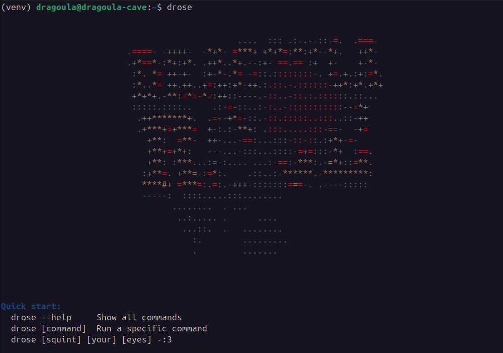

<div align="center">
  
  
  <h1>dRose v1.1.0</h1>
  
  <p>
    <b>The Ultimate YouTube Music Downloader</b>
  </p>

  [](https://www.python.org/)
  [](LICENSE)
</div>

---

A **Python-based CLI tool** to download **YouTube Music songs and playlists** in one click.

---

## 🚀 Features

- Download **single songs** or **entire playlists**  
- Choose **audio format** (`mp3`, `m4a`, etc.)  
- **CLI** for quick terminal downloads  
- Automatic **audio conversion** with **ffmpeg**  
- Optionally bundle multiple songs into a **ZIP file**  

---

## 🛠 Technologies Used

- **Python 3.12+** – main language  
- **yt-dlp** – core YouTube downloader  
- **ffmpeg** – audio conversion and processing  
- **imageio-ffmpeg** – Bundled FFmpeg binary (No installation required)

---

## 💾 Installation

### 1. Clone the repository

```bash
git clone https://github.com/AbdelAziz-Mseddi/dRose.git
cd dRose
```

### 2. Create and activate a virtual environment

**Windows:**
```bash
python -m venv venv
venv\Scripts\activate
```

**Linux / macOS:**
```bash
python -m venv venv
source venv/bin/activate
```

### 3. Install the package

**For regular use:**
```bash
pip install -e .
```

**For development (with web features):**
```bash
pip install -e ".[web]"
```

The package will be installed in editable mode with all CLI commands available.

---

## 🌐 Usage

### Getting Started

Run `drose` without arguments to see the welcome screen and quick start guide:

```bash
drose
```


### Available Commands

#### Download a Playlist

```bash
drose playlist "PLAYLIST_URL" [OPTIONS]
```

**Options:**
- `-o, --output_dir PATH` - Output directory (defaults to config)
- `-f, --format FORMAT` - Audio format: mp3, m4a, etc. (defaults to config)
- `-l, --list` - Show playlist information without downloading
- `-a, --all` - Show detailed info (duration, size, artists)

**Examples:**
```bash
# Download playlist with default settings
drose playlist "https://youtube.com/playlist?list=..."

# List playlist songs without downloading
drose playlist "PLAYLIST_URL" --list

# Download with custom format and output
drose playlist "PLAYLIST_URL" -f m4a -o ./downloads
```

#### Download a Song

```bash
drose song "SONG_URL" [OPTIONS]
```

**Options:**
- `-o, --output_dir PATH` - Output directory (defaults to config)
- `-f, --format FORMAT` - Audio format (defaults to config)
- `-l, --list` - Show song information without downloading
- `-a, --all` - Show additional info (release date, estimated size)

**Examples:**
```bash
# Download a single song
drose song "https://youtube.com/watch?v=..."

# Show song info without downloading
drose song "SONG_URL" --list --all
```

#### Configuration Management

```bash
# View current configuration
drose config show

# Set default output folder
drose config set output_folder "./downloads"

# Set default audio format
drose config set audio_format "mp3"

# Reset to default configuration
drose config reset
```

#### System Health Check

```bash
# Check if all dependencies are properly installed
drose doctor
```

#### Zip Downloaded Content

```bash
# Zip a folder (useful for downloaded playlists)
drose zip "./downloads/playlist-name" -o "./archive.zip"
```

### Other Options

```bash
# Show version
drose --version

# Show help
drose --help

# Get help for a specific command
drose playlist --help
```

---

## 📁 Project Structure

```text
dRose/
│
├── assets/             # Project assets (logos, ASCII art)
|
├── cli/                # Command-line interface
│   ├── app.py          # Main CLI entry point
│   ├── config_store.py # Configuration management
│   ├── config.default.json
│   └── commands/       # CLI command modules
│       ├── config.py   # Config command
│       └── doctor.py   # Doctor/health check command
│
├── core/               # Core functionality and business logic
│   ├── __init__.py
│   ├── downloader.py   # Main YouTube downloader using yt-dlp
│   ├── playlist.py     # Playlist parsing and extraction
│   └── utils.py        # Utility functions
│
├── tests/              # Test suite
│   ├── cli/
│   └── core/
│
├── pyproject.toml      # Project configuration
├── requirements.txt    # Python dependencies
└── README.md           # Project documentation
```
---

## 📋 Future Plans

- **Web interface** – A FastAPI-based web app with UI is planned for future releases
- **Enhanced features** – Improved UI/UX and additional download options
- **Download history** – Track previously downloaded content
- **Suggest new Songs** - Based on previous downloads
- **Playlist management** – Organize and manage playlists

---

## ⚠️ Notes

- The project uses a virtual environment for dependency management
- For Windows users, `.DS_Store` files are not relevant

---

## 🤝 Contributing

Feel free to:

- Add new features
- Improve UI/UX
- Optimize download speed
- Report issues or submit pull requests

---

## 📜 License

This project is licensed under the MIT License.